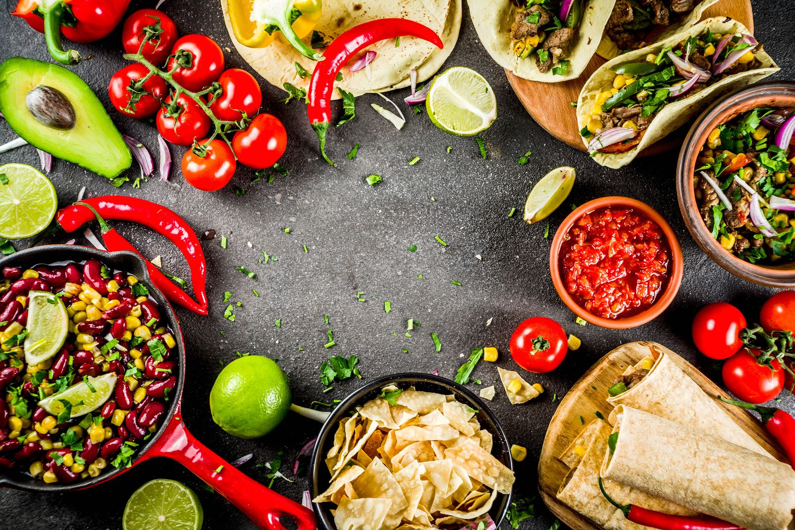
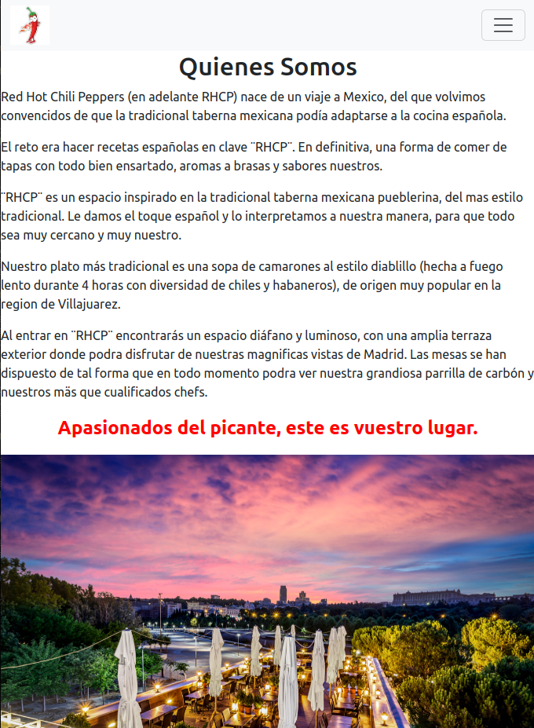
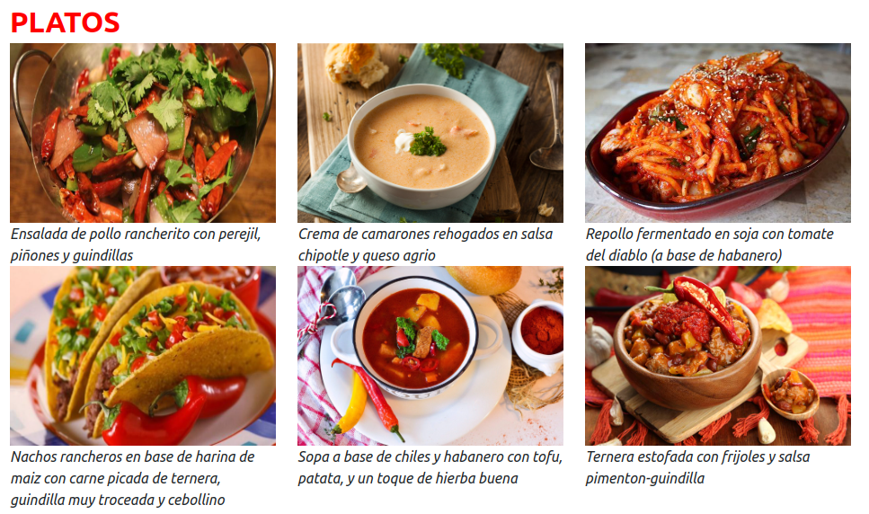
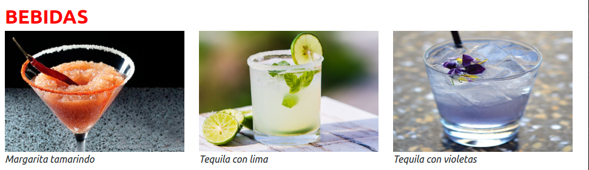
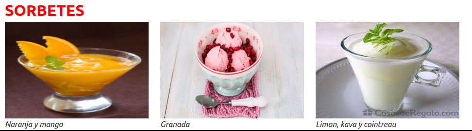
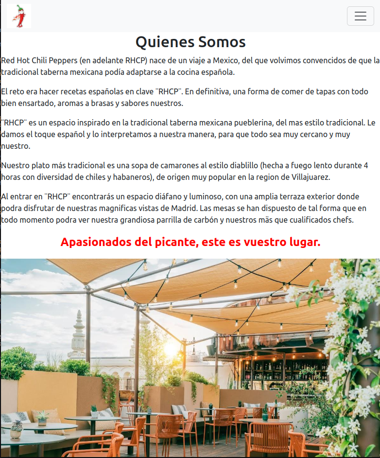
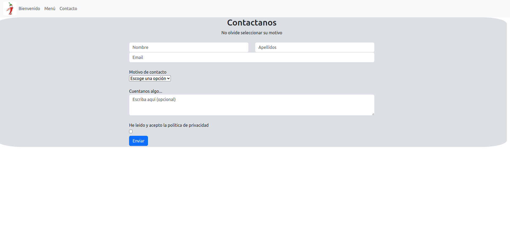
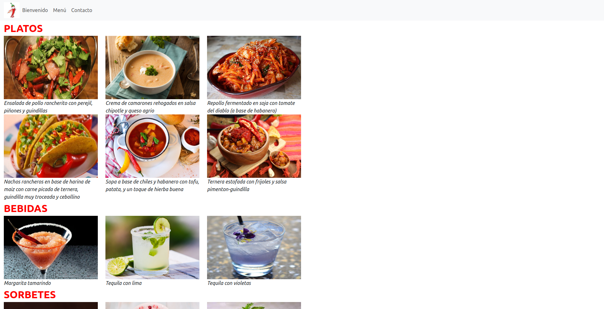

# PROYECTO 1 - Carta de restaurante

En este proyecto podrás encontrar una Presentación de una carta de restaurante.

## Tabla de contenidos

- [Composición](#composicion)
- [Desarrollo⛏️](#desarrollo)
- [Errores conocidos⛑️](#errores-conocidos)
- [Licencia y Copyright📃](#licencia-y-copyright)

 

### Composicion
- Esta pagina WEB esta distribuida en tres secciones:
        -Bienvenida o HOME: Una explicación breve del tipo de restaurante y su creación.
        -Carta: Donde encontraremos sus diferentes platos, bebidas y sorbetes.
        -Contacto: Formulario para realizar resrevas y reclamaciones.

 

### Desarrollo
- Todo el proyecto está desarrollado con **HTML 5, CSS 3 , CSS Layout y BOOTSTRAP**. Para su desarrollo se ha empleado Visual Studio Code y Google Chrome. La web del restaurante es completamente responsive y está diseñada para presentar un aspecto limpio y ordenado, en especial cuando se ejecuta en dispositivos móviles. Para el apartado responsive del proyecto, se ha utilizado Bootstrap 5.
 

### Errores conocidos
- En el apartado de Bienvenida, el margen izquierdo es inexistente.
- En el apartado de contacto, el margen izquierdo es inexistente, el formulario si que es responsive, pero su caja contenedora no.
- En el apartado de menu, sus diferentes subsecciones (platos, bebida y sorbetes), hay algunas fotos que no se adaptan a su visionado optimo (achatadas).

 

### Licencia y Copyright

Todo el contenido del repositorio se encuentra bajo licencia MIT. Las imágenes, son propiedad de Antonio Insa Benavent (https://www.linkedin.com/antonioinsa), este proyecto a sido desarroyado para la realización del bootcamp impartido por Geekshub academy en su XIX edicion.
